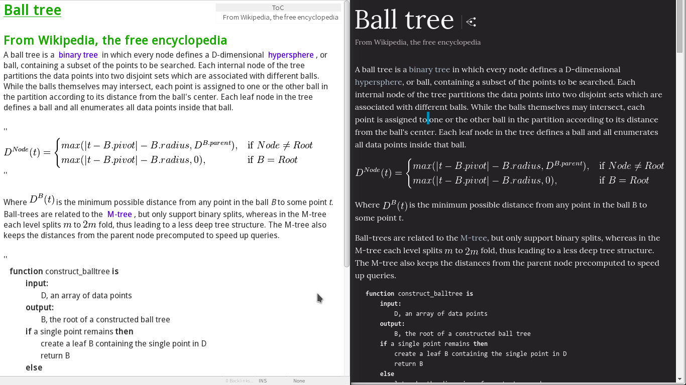

html2zim
=======
html到zim wiki语法格式转换工具, 使zim能像evernote一样用于网页剪辑.

* 图片引用链接将会显式输出
* 由于从剪贴板读取, 相对路径内容将不会被解析

建议配合klipper等剪贴板工具使用, 对剪贴板内容命令使用:

    clipcli text/html | html2zim -k path-to-where-you-store-zim-images
    
参数
-----

    html2zim [-k/-w pathToStore] [html_file]
    
    不指定html_file则从stdin读入
    -k使用kio下载图片, -w使用wget下载图片

html2zim
=======
Convert html to Zim wiki syntax, you can now use zim as a web clipper.

* href in or <a></img> will be explicit given as screenshot
* Relative path resource won't be converted

It is recommend to use klipper or other clipboard utilities for auto convertion with commandline:

    clipcli text/html | html2zim -k path-to-where-you-store-zim-images
    
Parameters
-----

    html2zim [-k/-w pathToStore] [html_file]
    
    Read from stdin if no html_file given.
    -k to download with kio, -w with wget
    
    
Screenshot (page from http://www.wikiwand.com/en/Ball_tree(Edited))
----

